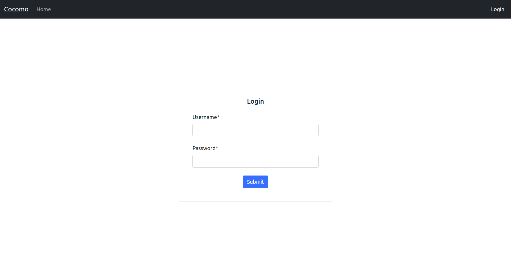
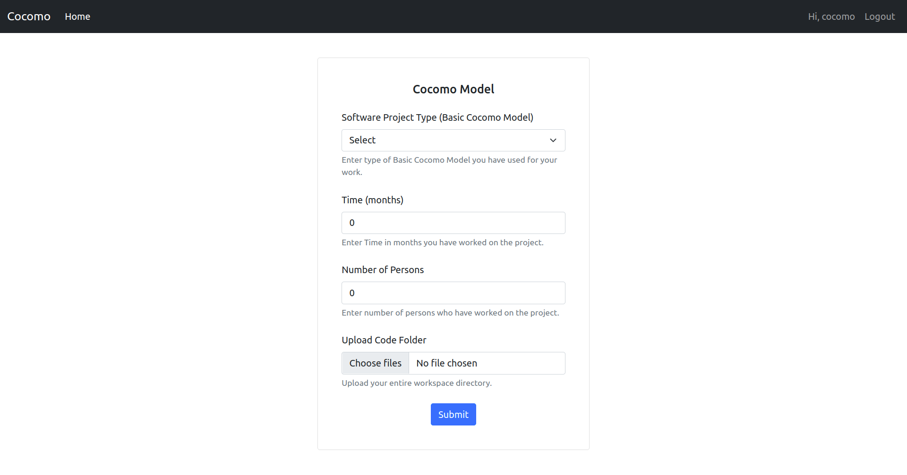
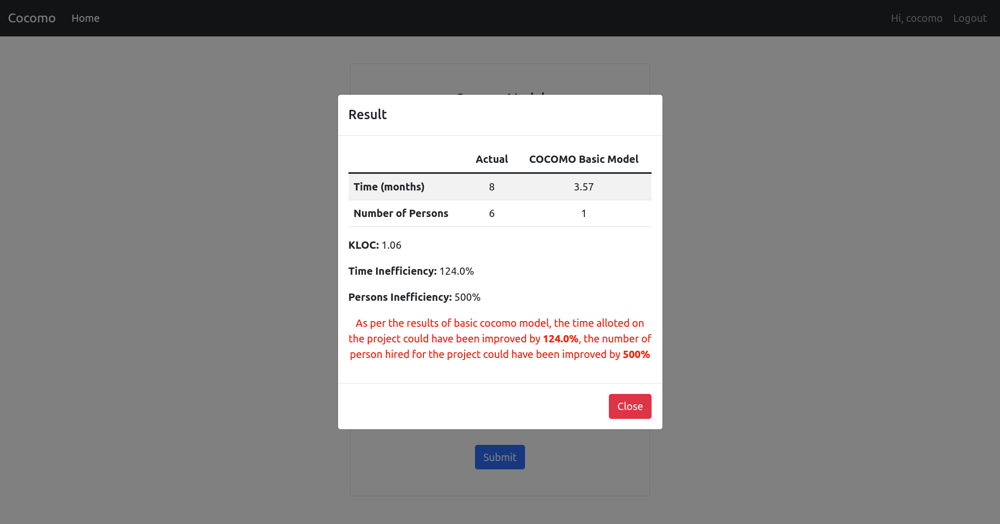

# Cocomo

This is a project made by [Kevin Joshi](https://github.com/KevinJ-hub), [Kaushal Binjola](https://github.com/KaushalBinjola), [Sparsh Gupta](https://github.com/Sparsh1101) & [Hardik Jain](https://github.com/hardikjain1708).  
It is hosted on [Heroku](https://www.heroku.com), you can check it out [here](https://cocomo.herokuapp.com). Database used is PostgreSQL which is hosted on Heroku as well and various dependencies like [Django Crispy Forms](https://django-crispy-forms.readthedocs.io/en/latest/) have been used.  
It is a web app that analysis the estimation accuracy for the time and number of people assigned on the project based on the Cocomo Basic Model.  

> **NOTE:** Since the app is hosted for free on heroku it goes to sleep on 30 mins of inactivity so there might be a possibility that the app takes a few seconds to load INITIALLY so please be patient.  

## Tech Used

- Python
- Django
- PostgreSQL
- Bootstrap5

## Running this project

You can head over to [https://cocomo.herokuapp.com](https://cocomo.herokuapp.com) to try out the app in your browser.  
  
**Login Credentials :-**  
Username: cocomo  
Password: django12

OR  

1. Clone the repository
2. Create a ".env" file in the root of the project and add the DB credentials and django project secret key in it (DB_NAME, DB_USERNAME, DB_PASSWORD, DB_HOST, SECRET_KEY)
3. Run the following command from the root of the project

```bash
pip install -r requirements.txt
```

```bash
py manage.py makemigrations
```

```bash
py manage.py migrate
```

4. Create a super user to access the app

```bash
py manage.py createsuperuser
```

5. Run the server

```bash
py manage.py runserver
```

> **NOTE:** You can also create a virtual environment, activate it and follow the above steps.

## Images


---


---


